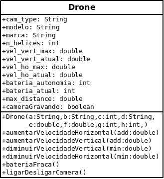

### UnB - Universidade de Brasilia
### FGA - Faculdade do Gama
### OO - Orientação por objetos
------

Atividade para realizar em dupla e entregar via GitHub. Uma entrega por dupla.
Prazo para entrega: ~~4/4/2017~~ 10/04/2017, 23:59:59.

**Questão 1:** Os termos abaixo estão relacionados ao paradigma de *Orientação por Objetos*. Defina cada um dos termos com base no livro-texto (Eck, David J. Introduction to Programming Using Java, 6th ed. 2011).
* classe: É uma estrutura que possui a finalidade de gerir um conjunto de objetos com caracterı́sticas similares,
por sua vez a classe define o comportamento de seus objetos utilizando de métodos e os estados possı́veis de seus
objetos através de atributos.
* objeto: Também chamado de Instância de uma classe, o objeto possui seu comportamento e estado definidos pela
classe que o gerou.
* elementos de classe: A classe vai possuir um nome, sua visibilidade, métodos e parâmetros que serão atribuı́dos às carac-
terı́sticas do objeto.
* atributos: Os atributos são propriedades nas quais serão atribuı́das ao objeto, essas propriedades vão definir o estado de um objeto, fazendo com que esses valores sofram qualquer alteração.
* métodos: são o que definem o que a classe vai fazer (as operações que todos os objetos instanciados por essa classe
vão ter).Os métodos são ações ou procedimentos, onde se pode interagir e se comunicarem com outros objetos. A
execução dessas ações se dá através de mensagens, tendo como função o envio de uma solicitação ao objeto para
que seja efetuada a rotina desejada.
* método construtor padrão: O construtor de um objeto é um método especial, pois inicializam seus atributos
toda vez que é executado, utilizando a palavra reservada new. Como construtor padrão ele não vai receber nenhum
parâmetro e irá preencher os atributos do objeto com valores pré-determinados pela linguagem.
* método construtor alternativo: como o construtor padrão é um método para iniciar um objeto, porém ele vai receber parâmetros que vão fazer parte dos atributos do objeto.
* estado de um objeto: um termo relativo aos atributos da classe, pois cada objeto têm seu próprio conjunto de
atributos, os quais foram definidos pela classe. Os valores atribuı́dos aos atributos de um objeto são o que definem o seu estado.
* retenção de estado: É a habilidade que o objeto possui de reter o conjunto de valores de seus atributos de operações que foram executadas previamente.

Classe é a estrutura definida pelo programador, contendo atributos e métodos (comportamento) comuns a um conjunto de objetos.

**Questão 2:** Julgue as seguintes frases como verdadeiras ou falsas e explique o motivo delas estarem certas ou erradas. Nos casos em que julgar uma sentença como errada, altere-a de modo a corrigi-la.

  a) Dois objetos instanciados através do método construtor padrão terão o mesmo estado e, portanto, suas referências serão iguais.
  * Resp: Falso, eles terão o mesmo estado (variáveis que descrevem o estado do objeto), porém, serão dois objetos diferentes
alocados em espaços diferentes na memória.

b) Uma classe pode ter apenas um método construtor alternativo para instanciação de seus objetos.
  * Resp:Falso, ela pode ter construtores especificos pelo usuário para atender necessidades especı́ficas na criação da classe.
c) Retenção de estados é uma propriedade do paradigma OO que permite aos objetos manterem os valores de seus atributos até o momento em que um estímulo externo ao objeto solicite uma alteração no valor de algum atributo.
  * Resp: Retenção de estados é uma propriedade do paradigma OO que permite aos objetos manterem os valores de seus atributos até o momento em que um estı́mulo externo ao objeto solicite uma alteração no valor de algum atributo.
d) Em Java, o operador . (ponto) serve para acessar somente os métodos de um objeto.
  * Resp: Não, também serve para acessa atributos da classe.
e) Métodos destrutores são aqueles métodos que são chamados explicitamente pelo algoritmo para destruir objetos e liberar os espaços que eles ocupam em memória. Em Java métodos destrutores são implementos com o nome **finalize()** e definidos em cada classe.
  * Resp: Verdadeiro, vale lembrar que o destrutor não é chamado pelo usuário.

**Questão 3:**  Considere o seguinte cenário:

*Um veículo aéreo não-tripulado (VANT, também conhecido como **drone** é todo e qualquer tipo de aeronave que não necessita de pilotos embarcados para ser guiada. Este tipo de aviões é controlado à distância por meios eletrônicos e computacionais, sob a supervisão de humanos, ou mesmo sem a sua intervenção, por meio de Controladores Lógicos Programáveis (CLP).* Fonte: [Wikipedia](https://pt.wikipedia.org/wiki/Ve%C3%ADculo_a%C3%A9reo_n%C3%A3o_tripulado)

Drones civis vendidos atualmente possuem, em sua maior parte, as seguintes características:

| Característica   | Valores (intervalo)         |
|:-----------------|:----------------------------|
| N. de hélices    | 4, 6 ou 8                   |
| Câmera           | SD, HD, UHD ou s-UHD        |
| Vel. vert. max.  | de 10 a 16 m/s              |
| Vel. hor. max.   | de 10 a 16 m/s              |
| Autonomia bateria| de 5 a 30 minutos de voo    |
| Distância máxima | de 50 metros a 20 kilometros|

Além dessas características, drones possuem as seguintes funções básicas: a) aumentar/diminuir velocidade vertical, b) aumentar/diminuir velocidade horizontal, c) iniciar/interromper gravação da câmera e d) diminuir velocidades máxima (horizontal e vertical) em 50% sempre que a autonomia da bateria for menor do que 5 minutos.

Dado esse cenário, pede-se aos alunos que representem (inicialmente) as características e comportamentos de um drone através de um diagrama de classes e, posteriormente, apresente a implementação dessa classe na linguagem Java.
*Diagrama da classe Drone*

**Código resposta:**


package drone;
class Drone{
     String cam_type;
     String modelo;
     String marca;
     int n_helices;
     double vel_vert_max;
     double vel_vert_atual;
     double vel_ho_max;
     double vel_ho_atual;
     int bateria_autonomia;
     int bateria_atual;
     double max_distance;
     boolean cameraGravando;

     //essas são padroes o resto vai ser mudado com os métodos do programa
     public Drone(String a, String b, int c, String d,double e, double f, int g, int h){
        marca=a;
        modelo=b;
        n_helices=c;
        cam_type=d;
        vel_vert_max=e;
        vel_ho_max=f;
        bateria_autonomia=g;
        max_distance=h;
     }

     void aumentarVelocidadeHorizontal(double add){
        if(vel_ho_atual+add<vel_ho_max)vel_ho_atual+=add;
        else System.out.println("Você excedeu o limite de velocidade, tente novamente!");   
     }
     void aumentarVelocidadeVertical(double add){
        if(vel_vert_atual+add<vel_vert_max)vel_vert_atual+=add;
        else System.out.println("Você excedeu o limite de velocidade, tente novamente!");   
     }

     void diminuirVelocidadeVertical(double min){
         if((vel_vert_atual-min)>0) vel_vert_atual-=min;
         else System.out.println("Valor inválido, tente novamente!");
     }
     void diminuirVelocidadeHorizontal(double min){
         if((vel_ho_atual-min)>0) vel_ho_atual-=min;
         else System.out.println("Valor inválido, tente novamente!");
     }

     void bateriaFraca(){
         if(bateria_atual<5){
             vel_vert_max*=0.5;
             vel_ho_max*=0.5;
         }
     }
     void ligarDesligarCamera(){
         cameraGravando=(!cameraGravando);
     }
}


**Questão 4:** Considerando a classe definida e implementada na questão 5, pede-se que os seguintes objetos sejam criados a partir do programa principal:

| Característica   | drone1         | drone2         | drone3            | drone4            |
|:-----------------|:---------------|:---------------|:------------------|:------------------|
| Marca            | Hubsan         | Hubsan         | DJI               | DJI               |
| Modelo           | X4 mini        | H501S X4 FPV   | Mavic Pro         | Spreading Wings   |
| N. de hélices    | 4              | 4              | 4                 | 8                 |
| Câmera           | SD             | HD             | UHD               | SUHD              |
| Vel. vert. max.  | 10 m/s         | 12 m/s         | 16 m/s            | 16 m/s            |
| Vel. hor. max.   | 10 m/s         | 12 m/s         | 16 m/s            | 16 m/s            |
| Autonomia bateria| 7 minutos      | 20 minutos     | 27 minutos        | 15 minutos        |
| Distância máxima | até 150 metros | até 1 kilometro| até 13 kilometros | até 13 kilometros |

Código resposta


package drone;

public class Centro{
    public static void main(String []args){

        //tipo camera,marca, modelo, helices,vert_maxx, ho_max,autonomia, distancia
        Drone a = new Drone("Hubsan","X4 mini",4,"SD",10,10,7,150/1000);
        Drone b = new Drone("Hubsan","H501S X4 FPV",4,"HD",12,12,20,1);
        Drone c = new Drone("DJI","Mavic Pro",4,"UHD",16,16,27,13);
        Drone d = new Drone("DJI","Spreading Wings",8,"SUHD",16,16,15,13);
    }
}



**Questão 5:** Ainda levando em consideração o cenário descrito nas questões 3 e 4, é necessário fazer com que os comandos realizados pelo usuário no controle remoto sejam enviados ao drone. Para isso, é necessário que o controle remoto estabeleça uma conexão com o drone. A partir desse momento é possível enviar os seguintes comandos ao drone: a) aumentar ou diminuir a velocidade vertical em passos de 1 m/s; b) aumentar ou diminuir a velocidade horizontal em passos de 1m/s e, c) ativar ou desativar a câmera. É importante ressaltar que um controle remoto só pode estar conectado a um drone apenas. Por fim, controles remotos possuem baterias com autonomia entre 60 e 90 minutos e alcance entre 20 metros e 20 kilometros.  

Desse modo, pede-se nessa questão que seja modelada e implementada em Java a classe que representa as características e o comportamento de um controle remoto, de modo que o drone possa ser comandado a partir do comandos enviados pelo controle remoto.
*Código Resposta*

package drone;

class Controle{
        Drone conexao;
        int autonomia;
        double distancia;

        //define qual drone será ligado ao controle, a autonomia e a distancia
        public Controle(Drone res,int auto,double dis){
                conexao = res;
                autonomia=auto;
                distancia=dis;
        }

        void aumentarVelocidadeVertical(){
            conexao.aumentarVelocidadeVertical(1);
        }
        void aumentarVelocidadeHorizonatal(){
            conexao.aumentarVelocidadeHorizontal(1);
        }

        void diminuirVelocidadeVerical(){
            conexao.diminuirVelocidadeVertical(1);
        }
        void diminuirVelocidadeHorizontal(){
            conexao.diminuirVelocidadeHorizontal(1);
        }

        void swichCam(){
            conexao.ligarDesligarCamera();
        }

}


**Questão 6:** Sejam os seguintes códigos da *ClasseA* e da aplicação principal escritas em JAVA.

Questao6.java

public class Questao6 {
  int   a1;
  float   a2;
  String  a3;
  boolean a4;

  public Questao6() {}

  public Questao6(int a, float b, String c, boolean d){
    a1 = a;
    a2 = b;
    a3 = c;
    a4 = d;
  }
}


Principal.java

public class Principal {
  public static void main (String[] args) {
    Questao6 q1,
             q2,
             q3;

    q1 = new Questao6();
    q2 = new Questao6(0, 0.0f, null, false);
    q3 = new Questao6(1, 1.0f, "null", false);

    //---> local onde a instrução do item c) será inserida.
  }
}

Responda as seguintes questões com base nos códigos acima:

a) As referências a1 e a2 para objetos de *ClasseA* são iguais?
* Resp: Não, as atribuições de ”a1”e ”a2”são os valores passados pelo construtor referentes a ”a”e ”b”respectivamente.
b) Qual o estado de cada dos objetos de cada referência?
* Resp:
q1: tem os atributos do construtor padrão (a1=0, a2=0.0, a3=null e a4=false), valores padrões do java.
q2: tem os valores inicializados pelo construtor especifico (a1=0, a2=0.0f, a3=null, a4=false), apesar de ter os
mesmos valores de q1 os construtores usados são diferentes.
q3: também usa o construtor especı́fico e os valores são inseridos por ele (a1=1, a2=1.0f, a3=”null”, a4=false), o valor de a3 é diferentes dos valores de q1 e q2, nesse caso a3 é uma string com 4 caracteres.

c) O que será impresso pela função *main* da classe *Principal* se a linha número *11* for igual a:
* Resp:
1º:false
2º:true
3º:false
4º:true
5º:false


System.out.println(q1 == q2);
System.out.println(q1.a1 == q2.a1);
System.out.println(q2.a3 == q3.a3);
System.out.println(q1.a2 == q2.a2);
System.out.println(q1.a4 == q3.a4);
System.out.println(q3 == q2);


**Questão 7:**
Seja o seguinte código em Java. Apresente o que será impresso ao final da execução do método **main** definido na classe **Principal**.


package questao7;
public class Principal {
  public static void main(String[] args) {
    Curso c1, c2;
    Aluno a1, a2, a3;
    c1 = new Curso(1, "Engenharia de Software", 240);
    c2 = new Curso(2, "Engenharia Eletrônica", 257);

    a1 = new Aluno("Andre", c1, 13, 23, 02, 1983);
    a2 = new Aluno("Maria", c2, 5, 27, 5, 1994);
    a3 = new Aluno("Junior", c1, 70, 16, 11, 1995);

    System.out.println(a1.obterDetalhes());
    System.out.println(a2.obterDetalhes());
    System.out.println(a3.obterDetalhes());
    a3 = a2;
    System.out.println(a1 == a2);
    System.out.println(a1 == a3);
    System.out.println(a2 == a3);
  }
}



package questao7;
public class Aluno {
  String nome;
  Curso curso;
  int matricula;
  int diaNascimento,
      mesNascimento,
      anoNascimento;

  public Aluno(String nom, Curso cur, int mat, int dNasc, int mNasc, int aNasc) {
    nome = nom;
    curso = cur;
    matricula = mat;
    diaNascimento = dNasc;
    mesNascimento = mNasc;
    anoNascimento = aNasc;
  }

  public String obterDetalhes() {
    String resposta = "";
    resposta += "Nome: " + nome + '\n';
    resposta += "Curso: " + curso + '\n';
    resposta += "Data de nascimento: " + diaNascimento + '/' +
                                     mesNascimento + '/' +
                                     anoNascimento;
    return resposta;
  }

  protected void finalize() {
    System.out.println("Esse objeto ALUNO vai ser destruido.");
    System.out.println("Detalhes do objeto: " + '\n');
    System.out.println(obterDetalhes());
  }
}



package questao7;
public class Curso {
  int codigo;
  String nomeCurso;
  int cargaHoraria;

  Curso (int cod, String nome, int ch) {
    codigo = cod;
    nomeCurso = nome;
    cargaHoraria = ch;
  }

  public String obterDetalhes() {
    String resposta = "";
    resposta += "Nome do curso: " + nomeCurso + '\n';
    resposta += "Codigo: " + codigo + '\n';
    resposta += "Carga horaria: " + cargaHoraria;
    return resposta;
  }

  protected void finalize() {
    System.out.println("Esse objeto CURSO vai ser destruido.");
    System.out.println("Detalhes do objeto: " + '\n');
    System.out.println(obterDetalhes());
  }
}

*Resposta*
Nome: Andre
Curso: (endereço)
Data de nascimento: 23/2/1983
Nome: Maria
Curso: (endereço)
Data de nascimento: 27/5/1994
Nome: Junior
Curso: (endereço)
Data de nascimento: 16/11/1995
Esse objeto ALUNO vai ser destruido.
Detalhes do objeto:

Nome: Junior
Curso: (endereço)
Data de nascimento: 16/11/1995
false
false
true

**Questão 8:** Considerando as classes **Aluno** e **Curso** definidas na questão 7, o que será impresso quando o *garbagge collector* de Java executar momentos antes do método **main()** da classe abaixo terminar sua execução?


package questao8;
public class Principal {
  public static void main(String[] args) {
    Curso c1, c2;
    Aluno a1, a2, a3;

    c1 = new Curso(1, "Engenharia de Software", 240);
    c2 = new Curso(2, "Engenharia Eletrônica", 257);

    a1 = new Aluno("Andre", c1, 13, 23, 02, 1983);
    a2 = new Aluno("Maria", c2, 5, 27, 5, 1994);
    a3 = new Aluno("Junior", c1, 70, 16, 11, 1995);

    a3 = a2;
    a2 = null;
    c2 = c1;
    c1 = null;
    c1 = a3.curso;
    a3 = a1;
    a1 = nul;

    //---> GARBAGGE COLLECTOR executa nesse instante
  }
}


*Reposta:* Somente os objetos referentes a a2 e a3 morrem, portanto a saída será:

Esse objeto ALUNO vai ser destruido.
Detalhes do objeto:

Nome: Maria
Curso: (endereço)
Data de nascimento: 27/5/1994.
Esse objeto ALUNO vai ser destruido.
Detalhes do objeto:

Nome: Junior
Curso: (endereço)
Data de nascimento: 16/11/1995

**Questão 9:** as cinco instruções listadas abaixo estão definidas no método **main()** da classe **Principal** e apresentam erros em suas sintaxes. Apresente quais são os erros, justifique-os e altere as instruções de modo a consertá-los. Considere os códigos das classes **Aluno** e **Turma** como sendo os códigos apresentados na questão 7.
*Reposta (comentário no código)*

package questao9;
public class Principal {
	public static void main(String[] args) {
		Curso c1, c2;
		Aluno a1, a2, a3;

		c2 = new Curso(2, "Engenharia Eletrônica", 257);

		a1 = new Aluno("Andre", c1, 13, 23, 02, 1983);
		a2 = new Aluno("Maria", c2, 5, 27, 5, 1994);

		Curso.obterDetalhes();
    //c1.obterDetalhes(); -- Curso é uma classe não objeto
		c2.matricula = 20;
		Curso.nome = "Ciência da computação";
    //c2.nome="Ciência da computação"; -- Curso é uma classe não um objeto.
		c1.codigo = 21;
		Aluno.obterDetalhes();
    //a3.obterDetalhes(); -- Alunos é uma classe não um objeto.
		a3.cargaHoraria() = 220;
    //a3.cargaHorario=220; -- cargaHoraria é um atributo de um objeto aluno não um método.
}

**Questão 10:** sabe-se que um curso em é formado por um conjunto de disciplinas, para as quais são definidas as seguintes características:

* um código da disciplina;
* um nome;
* uma carga horária, e
* um departamento responsável por lecionar tal disciplina.

Sabe-se ainda que para cada disciplina são criadas diversas turmas. Cada turma é descrita através das seguintes características:

* um código da turma;
* um número total de vagas;
* um número de vagas livres;
* um número de vagas ocupadas, e
* dias/horarios em que ela ocorre.

Além disso, é necessário que os alunos se matriculem nessas turmas. Tal procedimento consiste em associar os alunos em uma turma específica (caso haja vagas) e aumentar o número de vagas ocupadas.

Considerando o contexto formado pelas classes **Aluno** e **Curso** (vide implementação na questão 7) e a descrição acima, pede-se:

a) em Java, crie uma classe que seja capaz de representar as características e o comportamento de uma turma.

b) Crie as seguintes turmas:
   * turma 1 de Orientação por objetos, com 46 vagas livres, que ocorre todas as 4as e 6as feiras, das 12:00 às 16:00 horas;
   * turma 1 de Desenvolvimento Avançado de software, com 30 vagas livres, que ocorre todas as 4as. e 6as. feiras, das 16:00 às 18:00 horas.

c) associe ambas turmas recem-criadas ao curso de Engenharia de Software,

d) matricule Andre e Maria na turma de orientação por objetos, e Junior na turma de desenvolvimento avançado de software.
*Código Resposta*

*Classe Aluno*

package questao10;
public class Aluno {
  String nome;
  Turma turma;
  int matricula;
  int diaNascimento,
      mesNascimento,
      anoNascimento;

  public Aluno(String nom, int mat, int dNasc, int mNasc, int aNasc) {
    nome = nom;
    matricula = mat;
    diaNascimento = dNasc;
    mesNascimento = mNasc;
    anoNascimento = aNasc;
  }
}

*Classe Curso*

package questao10;
public class Curso {
  int codigo;
  String nomeCurso;
  String departamento;
  int cargaHoraria;

  Curso (int cod, String nome,String dp, int ch) {
    codigo = cod;
    nomeCurso = nome;
    cargaHoraria = ch;
    departamento=dp;
  }
}

*Classe Turma*

package questao10;

class Turma{
    Curso curso;
    int code;
    int tot_vagas;
    int res_vagas;
    String dias;
    String horario;

    public Turma(Curso in,int c, int max,String d,String h){
       curso=in;
       c=code;
       tot_vagas=max;
       dias=d;
       h=horario;
    }

    void registrarAluno(Aluno in){
        if(res_vagas+1>tot_vagas) System.out.println("Número de vagas excedido");
        else{
            res_vagas++;
            in.turma=this;
        }

    }
}

*Classe Main*

package questao10;

public class MyMain{
    public static void main(String[]args){
        Curso s = new Curso(2, "Engenharia Software","Departamento de Tecnologia", 240);

        Turma turma1 = new Turma(s,1,46,"Quarta e Sexta","12:00 as 16:00");
        Turma turma2 = new Turma(s,2,30,"Quarta e Sexta","16:00 as 18:00");

        Aluno a1 = new Aluno("Andre", 13, 23, 02, 1983);
        Aluno a2 = new Aluno("Maria", 5, 27, 5, 1994);
        Aluno a3 = new Aluno("Junior", 70, 16, 11, 1995);

        turma1.registrarAluno(a1);
        turma1.registrarAluno(a2);
        turma2.registrarAluno(a3);

     }
}

## Referências:
\[[OPEN ACCESS][eckDavid]\] Eck, David J. Introduction to Programming Using Java, 6th ed. 2011

---
*Última modificação: 7 de abril de 2017, 05:12.*

[eckDavid]: http://math.hws.edu/javanotes/
