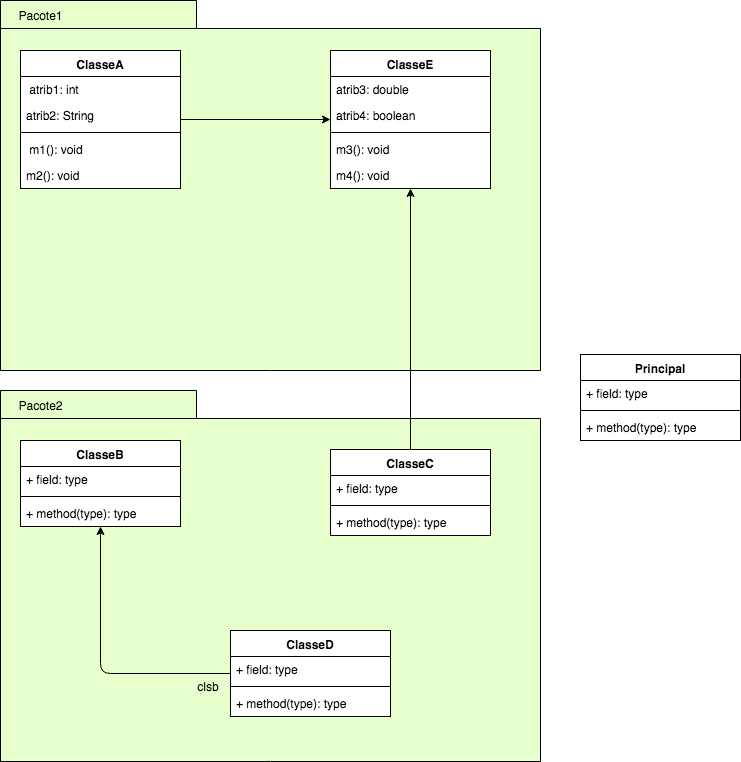

### UnB - Universidade de Brasilia
### FGA - Faculdade do Gama
### DAS - Desenvolvimento Avançado de Software
------


Para cada um dos cenários descritos abaixo faça o que se pede abaixo: 

* Modelar um diagrama de classes quais as classes e seus atributos para o seu projeto de software. 
* As classes deverão ser organizadas em pacotes de modo a agrupar as classes afins e, consequentemente, criar _namespaces_ para serem utilizados pela aplicação.
* Implementar uma classe Principal que deverá apresentar ao usuário o menu de opções da aplicação. Todos as funcionalidades previstas para a aplicação deverão ficar disponíveis nesse menu. Obs.: você deverá ser capaz de identificar quais são essas funcionalidades com base em cada cenário descrito. 

**Cenário 1:** Considere uma aplicação bancária a ser desenvolvida. Para cada correntista deverão ser informados o nome, sexo e CPF. Cada correntista deverá ser vinculado à, no máximo, uma conta-corrente. Cada conta-corrente deverá ser caracterizada por um número de agência, número da conta e saldo. O saldo no momento da abertura deve ser igual a R$0,00. Uma conta pode originar várias transações sendo que cada transação pode ser depósito, saque ou transferência de um valor para outra conta-corrente. Cada operação tem um custo conforme definido abaixo: 

|  Operação     |  Custo, em R$  |
|:--------------|:---------------|
| Depósito      | R$ 0,00        |
| Saque         | R$ 4,00        |
| Transferencia | R$ 8,00        |

------

**Cenário 2:** Considere as figuras geométricas: 

* quadrado; 
* retangulo;
* triangulo equilátero; 
* trapézio e, 
* círculo. 

Crie um programa que seja capaz de calcular o perímetro e a área de cada uma dessas figuras de modo que, para cada cálculo você deverá criar um objeto específico. Por exemplo: dados dois círculos de raios 2 e 3cm, respectivamente. Para calcular o perímetro e área de cada um deles, você deverá criar dois objetos do tipo Círculo, cada um mantendo a sua própria medida de raio. Para cada um desses objetos você deverá executar os métodos de cálculo. Nível de dificuldade: :relaxed:

-----

**Cenário 3:** Deseja-se criar uma aplicação capaz de calcular o valor de prestações a serem pagas para um dado empréstimo. Para realizar o cálculo da prestação, inicialmente é necessário calcular o Coeficiente de Financiamento (CF) dado pela seguinte fórmula: 

$$CF = \frac{1}{1-\frac{1}{(1+i)^n}} $$
onde $$i$$ representa a taxa de juros e $$n$$ o número de parcelas em meses.

Uma vez que $$CF$$ foi calculado pode-se calcular o valor de cada parcela pela seguinte fórmula:
$$PMT = PV \times CF$$,
onde $$PV$$ corresponde ao valor financiado e $$PMT$$ corresponde ao valor de cada uma das prestações.

Cada empréstimo está associado a um cidadão. Esse cidadão pode simular vários financiamentos, variando o número de parcelas e a taxa de juros. Para cada uma dessas simulações, informe ao cidadão o quanto ele vai pagar de juros ao final do financiamento.
Nível de dificultade: :confused:

-----

**Cenário 4:** Deseja-se criar um sistema gerenciador de menções para turmas da FGA. Sabe-se a princípio que uma turma possui vários alunos. Para cada aluno deseja-se armazenar seu nome, matrícula e endereço de email. Uma turma tem um número máximo de vagas e um número de vagas livres, calculadas pela diferença entre o máximo de vagas e o número de alunos matriculados nela. A cada turma são aplicadas 3 avaliações, 2 trabalhos e há ainda uma nota relativa à participação do aluno em sala. Para efeito de cálculo da menção as avaliações e os trabalhos possuem um peso associado à nota (o peso para participação em sala de aula é sempre igual a 0.5). 
 
Portanto, o cálculo da menção para cada aluno é dado pela seguinte fórmula:

$$ Nota = \frac{\sum av_i \times p_{av_i} + \sum tr_i \times p_{tr_i} + part \times 0.5}{\sum p_{av_i} + \sum p_{tr_i} + 0.5} $$


Com base no valor de $Nota$, a menção final é calculada de acordo com a tabela abaixo:

| Menção | Nota |
|:-------|:-----|
| SR     | 0.1 < Nota |
| II     | 0.1 $$\leq$$ Nota < 3.0 |
| MI     | 0.1 $$\leq$$ Nota < 5.0 |
| MM     | 0.1 $$\leq$$ Nota < 7.0 |
| MS     | 0.1 $$\leq$$ Nota < 9.0 |
| SS     | Nota $$\gt$$ 9.0 |

Nível de dificuldade: :confused:


-----

Para os exercícios abaixo, considere o seguinte diagrama de classes. Obs.: O
diagrama de classes está incompleto propositalmente.   
_Clique sobre a figura para exibi-la no tamanho original_  
[](diagClasses.png)

**Modificadores de acesso:** Considerando o diagrama de classes anterior, verifique se as seguintes instruções abaixo estão corretas. Caso não estejam, _justifique_ o motivo pelo qual ela está errada.

Considere as seguintes implementações do método _m2()_ definido na _ClasseA_:
```java
void m2() {
   //Substitua aqui as instruções abaixo e verifique se elas estão corretos ou não
}
```

```java
//instrucao 1
atrib2 = "foo";

//instrucao 2
clse = new ClasseE();
clse.atrib3 = 4.0;
clse.m3();
clse.m4();
clse.atrib4 = true;
```

Considere as seguintes implementações do método _m8()_ da _ClasseD_:
```java
void m8() {
   //Substitua aqui as instruções abaixo e verifique se elas estão corretos ou não
}
```

```java
//conjunto de instruçoes 1
clsb = new ClasseB();
clsb.atrib5 = false;
clsb.atrib7 = "foo";
clsb.atrib6 = 3.14f;
clsb.m5();
clsb.m7();
```

```java
//conjunto de instruções 2
new ClasseC().m6();
```

```java
//conjunto de instruções 3
atrib9 = clsb.atrib6;
```


Considere as seguintes implementações do método _main()_ da _Principal_:
```java
static void main(String[] args) {
   //Substitua aqui as instruções abaixo e verifique se elas estão corretos ou não
}
```

```java
ClasseA a = new ClasseA();
a.m2();
a.atrib2 = "foo";
```
